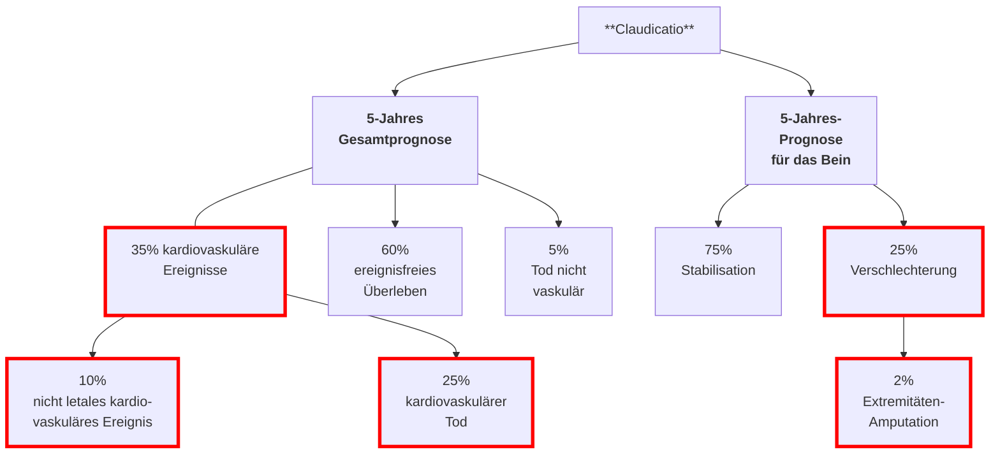

## Prognose bei pAVK (1)

```mermaid {theme: 'neutral', scale: 0.6}
flowchart TD;
A[**Claudicatio**]
A --> B["`**5-Jahres
Gesamtprognose**
<br>`"]
A-->C["`**5-Jahres-
Prognose
für das Bein**`"]
B---D["`35% kardiovaskuläre
Ereignisse
<br>`"]:::red
B-->E["`60%
ereignisfreies
Überleben`"]
B-->F["`5%
Tod nicht
vaskulär`"]
C-->G["`75%
Stabilisation
<br>`"]
C-->H["`25%
Verschlechterung
<br>`"]:::red
D-->I["`10%
nicht letales kardio-
vaskuläres Ereignis`"]:::red
D-->J["`25%
kardiovaskulärer
Tod`"]:::red
H-->K["`2%
Extremitäten-
Amputation`"]:::red
classDef red stroke:#f00,stroke-width:4px
```

Modifiziert nach TransAtlantic Inter-Society Consensus (TASC) Working group, J Vasc Surg 2007
