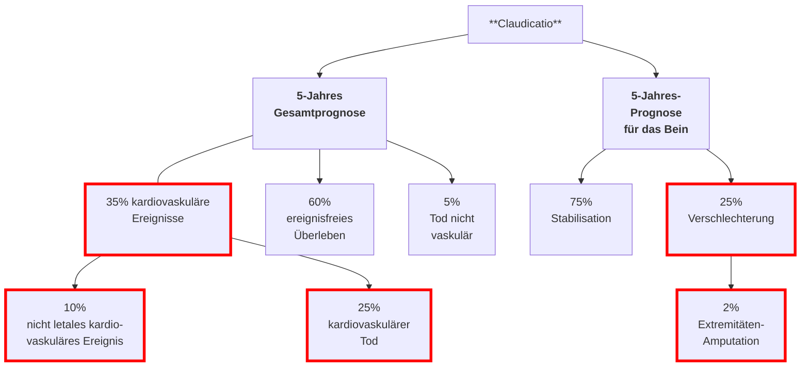

# Arterienverkalkungen und arterielle Verschlusskrankheit

## = schicksalshafte Erkrankung?

Klinik im Dialog - 09. Dezember 2024

---
src: ./pages/anatomie.md
---

---
layout: image-left
image: ./assets/arterien_hand.webp
---

## Schlagadern

Verteilung

<!--

-->

---
layout: image-right
image: ./assets/plaque.avif
---

## Verkalkungen

---

## Prognose bei pAVK (1)

Modifiziert nach TransAtlantic Inter-Society Consensus (TASC) Working group, J Vasc Surg 2007
